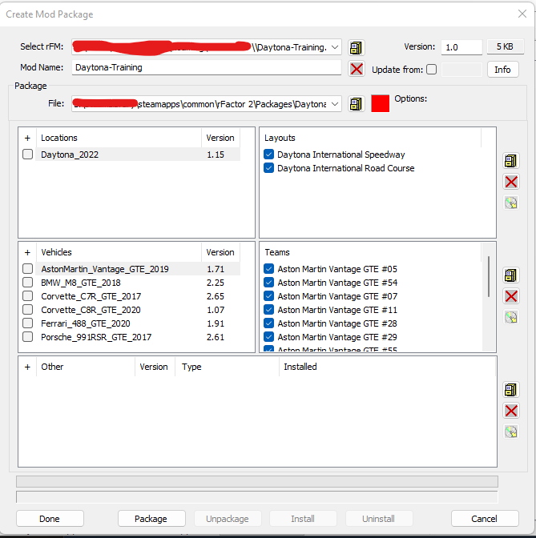

# rfactor2-hosting-tools

A repository with a bunch of tools and resources to ease Rf2 server usage.

## How to create paid content serie for dedicated server

This guide is based on:
- [rFactor 2 Quick Guide: Creating Custom RaceEvents](https://steamcommunity.com/sharedfiles/filedetails/?id=554544322)
- [rFactor2 Dedicated Hosting (on AWS for free)](https://github.com/afloesch/rfactor2-server-setup)

To do so, you need a license of the rFactor 2 game plus the DLCs you wish to add to the server.

### Install the dedicated server

#### Pre requisite

- A **directory** on the target computer with **read/write access**
- The target computer has **access to internet**.

#### Installation scenario

- Create directory on the target computer
- Copy the script [install-new-dedicated-server](./installation-scripts/install-new-dedicated-server.ps1)
  - Set the Rf2InstallationDirectory parameter to set the dedicated server installation path
- Run the script

The steamcmd archive is downloaded to the current directory. Then the steamcmd command is invoked to download rFactor2 dedicated server.

### Open MAS2 utility

#### First time setup

- Click on the 4th icon on the toolbar "Set package directory"
- In the game installation folder select the package folder

#### Create the package

- Click on the 6th icon on the toolbar to create a package
- Click on "Create New Mod Package"
  - Give the mod a name
- Select the track(s)
- Select the car(s)
- You arrive at the Create Mod Package screen

- Click package
- Click install
- Click done

### Checking that package works

- Start the game
- Go to single player
- Click on "Select series"
  - You should see you package name here

## Creating a serie with paid content on dedicated server

